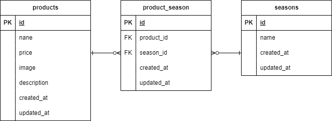

# もぎたて

## 環境構築
**Dockerビルド**
1. `git clone git@github.com:sano-san-dayo/test-2.git`
2. `cd test-2`
3. `docker-compose up -d --build`


**Laravel環境構築**
1. `docker-compose exec php bash`
2. `composer install`
3. `cp .env.example .env`
4. .envの下記変更
　(変更前)
　　DB_HOST=127.0.0.1
　　DB_PORT=3306
　　DB_DATABASE=laravel
　　DB_USERNAME=root
　　DB_PASSWORD=
　(変更後)
　　DB_HOST=mysql
　　DB_DATABASE=laravel_db
　　DB_USERNAME=laravel_user
　　DB_PASSWORD=laravel_pass
5. アプリケーションキーの作成
``` bash
php artisan key:generate
```
6. マイグレーションの実行
``` bash
php artisan migrate
```
7. シーディングの実行
``` bash
php artisan db:seed
```
8. シンボリックリンク作成
``` bash
php artisan storage:link
```

## 使用技術(実行環境)
- PHP8.3.0
- Laravel8.83.27
- MySQL8.0.26

## ER図


## URL
- 開発環境：http://localhost/
- phpMyAdmin:：http://localhost:8080/
